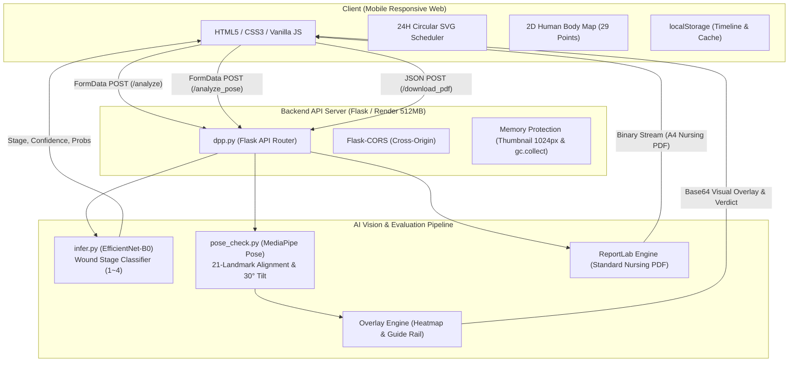
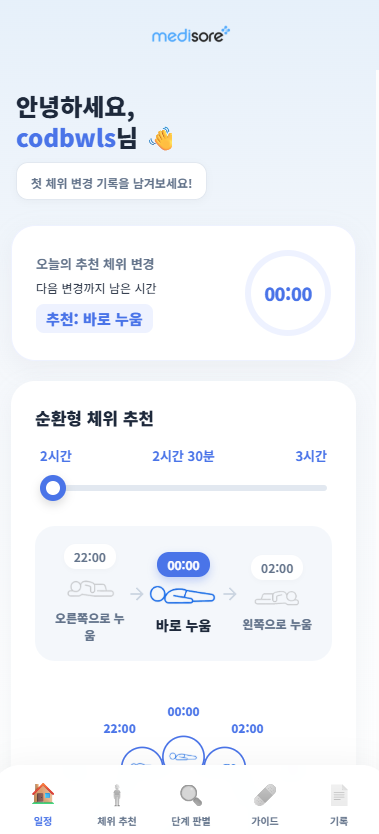
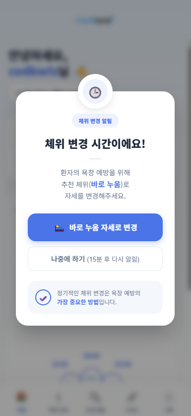
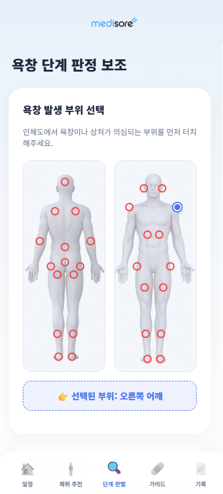
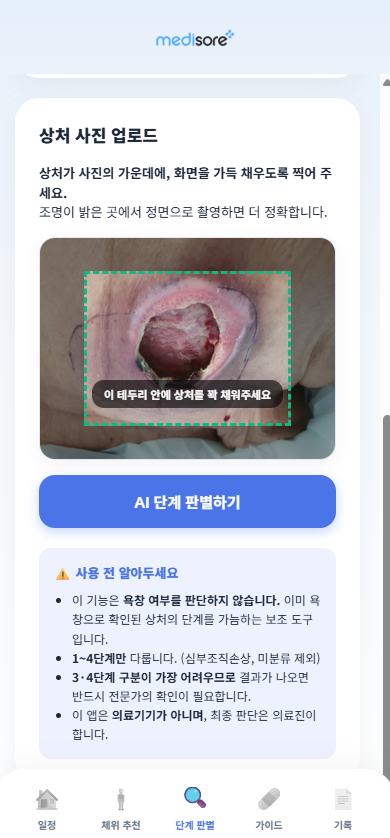
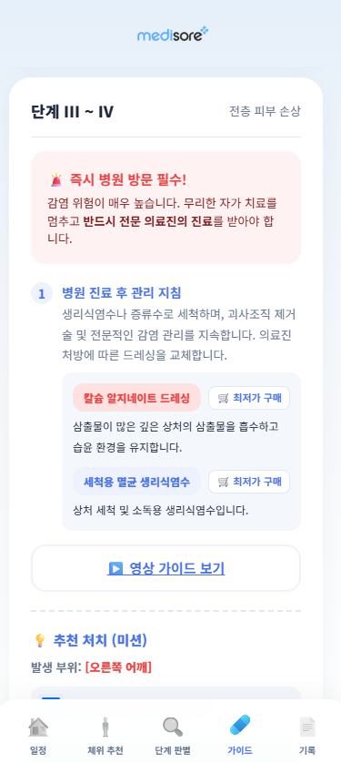
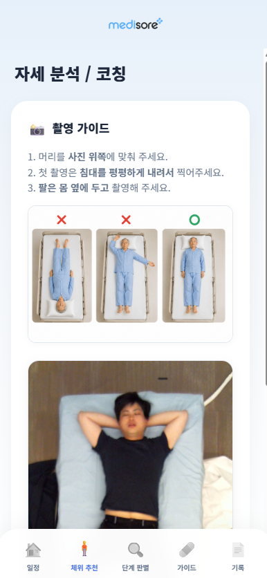
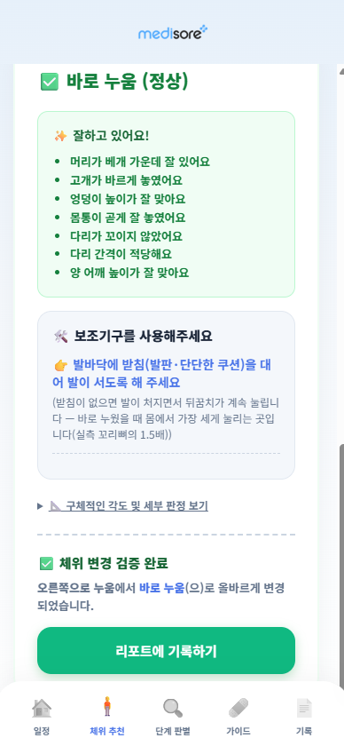
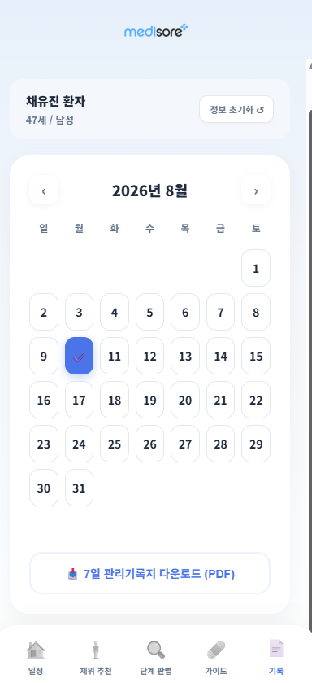
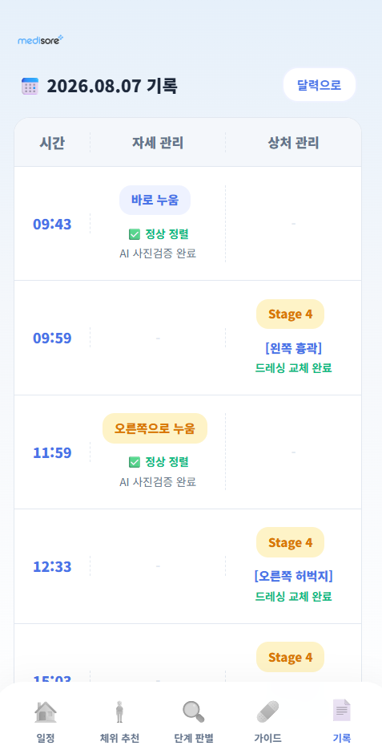

# 🩺 메디소어 (Medisore)

<div align="center">


### **AI 기반 비전문 간병인용 욕창 예방·관리 통합 모바일 서비스**
*"단순한 시간 알림과 상태 판별을 넘어, **판단(AI) ➡️ 행동(체위 코칭) ➡️ 기록(간호기록지 자동화)**으로 이어지는 올인원 돌봄 솔루션"*

[](https://www.python.org/)
[](https://pytorch.org/)
[](https://flask.palletsprojects.com/)
[](https://developers.google.com/mediapipe)
[](https://www.reportlab.com/)
[]()
[](LICENSE)
[]()

<br/>

[📱 라이브 웹앱 체험](https://ychae22.github.io/Medisore/) · [🌐 백엔드 API (Render)](https://medisore-api.onrender.com/) · [📖 서비스 아키텍처](#-3-서비스-아키텍처--기술-파이프라인) · [🩺 임상 검증 결과](#-5-임상-현장-사전-수용성-조사-clinical-validation)

</div>

---

## 📌 목차 (Table of Contents)
- [1. 프로젝트 배경 및 문제 정의](#-1-프로젝트-배경-및-문제-정의-background--problem-definition)
- [2. 메디소어 4대 핵심 기능](#-2-메디소어-4대-핵심-기능-key-features)
- [3. 서비스 아키텍처 & 기술 파이프라인](#-3-서비스-아키텍처--기술-파이프라인-system-architecture)
- [4. AI 모델링 및 성능 평가](#-4-ai-모델링-및-성능-평가-ai-modeling--evaluation)
- [5. 임상 현장 사전 수용성 조사 (Clinical Validation)](#-5-임상-현장-사전-수용성-조사-clinical-validation)
- [6. UI 화면 갤러리 (Screenshots)](#-6-ui-화면-갤러리-screenshots)
- [7. 기술 스택 (Tech Stack)](#-7-기술-스택-tech-stack)
- [8. 로컬 설치 및 실행 방법 (Getting Started)](#-8-로컬-설치-및-실행-방법-getting-started)
- [9. 디렉토리 구조 (Structure)](#-9-디렉토리-구조-structure)
- [10. 팀원 소개 및 역할 분담 (Team Behind Medisore)](#-10-팀원-소개-및-역할-분담-team-behind-medisore)
- [11. 비즈니스 모델 및 성장 로드맵](#-11-비즈니스-모델-및-성장-로드맵-business-model--roadmap)

---

## 💡 1. 프로젝트 배경 및 문제 정의 (Background & Problem Definition)

### 👵 초고령사회 진입과 장기 돌봄 수요 급증
- 2025년 대한민국은 고령 인구 비중이 20.3%를 넘어서는 **초고령사회**로 진입하며, 장기요양 환자 수는 **123만 명**을 넘어설 것으로 예측됩니다.
- 특히 요양시설 노인 환자의 약 **11.6%(10명 중 1명 이상)**에서 욕창이 발생하며, 누워있을 때 압력이 집중되는 **천골(엉치뼈), 발뒤꿈치, 대전자(골반 측면)** 부위의 위험도가 매우 높습니다.

### ⚠️ 돌봄 현장의 3대 단절 지점 (관리의 공백)
임상 간호사가 상주하기 어려운 가정 및 요양 현장에서는 비전문 간병인과 가족 보호자가 돌봄을 전담하고 있습니다. 그러나 이 과정에서 세 가지 치명적인 단절이 발생합니다:

```
[기존 돌봄의 악순환]
판단 편차 (초기 발적 vs 단순 눌림 구별 불가)
   ⬇️
수행 편차 (올바른 체위 각도 및 쿠션 지지법 미숙지)
   ⬇️
정보 단절 (교대 시 수기·구두 인수인계로 체위 변경 누락 발생)
   ⬇️
"욕창 급속 악화 (Stage 1 ➡️ Stage 4 전층 피부 괴사)"
```

1. **판단 편차**: 초기 발적(Stage 1)과 단순 피부 눌림을 눈으로 구별하지 못해 치료 골든타임을 놓침
2. **수행 편차**: 앙와위/측위 변경 시 척추 선열과 **30도 경사 체위(30° Tilt)** 기준을 알지 못해 잘못된 자세로 압력 가중
3. **정보 단절**: 간병인 교대 시 수기 메모나 기억에만 의존하여 체위 변경 누락 및 관리 방치 발생

### 🎯 메디소어(Medisore)의 해결책
메디소어는 **비전 AI(Computer Vision)**와 **표준 간호기록 자동화 기술**을 결합하여, 끊어진 돌봄의 세 고리를 단 하나의 앱으로 연결합니다:
- **판단**: **EfficientNet-B0** 기반 욕창 1~4단계 자동 분류 & 안전 거절(Rejection) 로직
- **수행**: **MediaPipe Pose** 기반 누운 자세 21개 관절 분석 & 압력 부위 히트맵 코칭
- **기록**: **ReportLab** 기반 실제 상급종합병원 표준 간호기록지 양식의 주간 PDF 자동 생성

---

## ⭐ 2. 메디소어 4대 핵심 기능 (Key Features)

### 1️⃣ 2D 인체도 기반 욕창 단계 자동 분류 (`/analyze`)
- **2D 인터랙티브 인체도(Body Map)**: 비전문가가 알기 어려운 의학적 명칭 대신, 전면/후면 29개 주요 호발 포인트를 터치하여 부위를 직관적으로 지정합니다.
- **EfficientNet-B0 전이학습 모델**: 업로드된 환부 사진을 실시간 분석하여 **Stage 1 ~ Stage 4** 단계를 도출하고 확률 분포(Softmax Probs)를 반환합니다.
- **임상 안전 신뢰도 임계값 (Confidence Threshold $	au=0.55$)**: 확신도가 55% 미만인 불명확하거나 흔들린 사진은 임의로 단계를 판정하지 않고, *"확신도가 낮습니다. 상처가 화면에 크게 담기도록 다시 촬영해 주세요"* 경고와 함께 재촬영을 유도합니다.
- **처치 가이드 자동 스크롤 & 체크리스트**: 판정 완료 즉시 해당 단계에 맞는 드레싱·세척 가이드로 화면이 부드럽게 자동 스크롤되며, 하단 체크박스('세척 및 드레싱 교체 완료')를 통해 실제 행동 완료를 유도합니다.

### 2️⃣ MediaPipe 기반 환자 체위 분석 및 자세 코칭 (`/analyze_pose`)
- **천장 단일 카메라 사진 1장 분석**: 별도의 고가 압력 센서 매트 없이, 스마트폰 사진 1장으로 **관절 21개 키포인트**를 추출합니다.
- **자세 자동 판별 (Auto-detection)**: 바로 누운 자세(**앙와위, Supine**)와 옆으로 누운 자세(**측위, Lateral**)를 신체 좌표 비율로 자동 판별합니다.
- **기준값(W0, H0, L0) 자동 보정**: 첫 앙와위 촬영 시 어깨너비(W0), 골반너비(H0), 다리길이(L0)를 캘리브레이션하여 개인별 체형 편차를 보정합니다.
- **압력 집중 부위 히트맵 & 3색 신호등 판정**:
  - 🟢 **정상(초록)** / 🟡 **주의(노랑)** / 🔴 **불량(빨강)** 피드백
  - 머리 중심 정렬, 고개 각도, 어깨/골반 수평, 다리 벌림 각도, 꼬임 여부 판정
  - **30도 경사 측위 가이드**: 대전자(골반 측면 뼈) 압박을 방지하기 위한 임상 표준 30도 지지 코칭 및 등 뒤/무릎 사이 쿠션 배치 안내

### 3️⃣ 24시간 순환형 체위 스케줄러 & 능동 알림
- **동적 SVG 원형 타임테이블**: 삼각함수 기반 각도 계산으로 24시간 순환 체위 스케줄을 실시간 렌더링합니다.
- **주기 설정 슬라이더**: 환자 상태에 따라 **2시간 / 2시간 30분 / 3시간** 체위 변경 간격을 즉각 재계산합니다.
- **순환 체위 안내**: `바로 누움(앙와위) ➡️ 우측위(오른쪽) ➡️ 좌측위(왼쪽)` 순환 주기를 시각화하고 다음 체위 변경 시점 카운트다운을 제공합니다.
- **일일 목표 달성률 시각화**: 일일 권장 체위 변경 횟수(8회 이상) 달성 여부를 분석하여 간병인의 지속적인 동기부여를 지원합니다.

### 4️⃣ 임상 표준 간호기록지(PDF) 자동 생성 (`/download_pdf`)
- **실제 상급종합병원 표준 양식 벤치마킹**: 파이썬 `ReportLab` 엔진을 활용해 주간 상세 간호기록지를 PDF 문서로 자동 생성합니다.
- **통합 타임라인 적재**: 하루 동안 진행된 자세 변경 검증 기록과 상처 드레싱 내역이 24시간 시계열로 자동 병합됩니다.
- **그래픽 바디맵 마킹**: 발생한 욕창 부위가 A4 리포트 상의 전면/후면 신체도에 자동으로 원형 마킹됩니다.
- **전문적 인수인계 자료화**: 비전문 간병인이 앱을 터치하며 남긴 일상 기록이, 교대자 및 담당 의료진에게 전달될 때는 가장 표준화된 전문 인수인계 문서로 자동 변환됩니다.

---

## 🏗️ 3. 서비스 아키텍처 & 기술 파이프라인 (System Architecture)



### ⚡ 512MB 경량 클라우드(Render) 최적화 설계
- `torch.set_num_threads(1)` 및 `torch.set_num_interop_threads(1)` 설정으로 CPU 스레드 과점유 방지
- `@torch.inference_mode()` 적용으로 autograd 메모리 오버헤드 제거
- 스마트폰 고화질 업로드 사진 수신 시 512~1024px 사전 썸네일 축소 및 `gc.collect()` 수동 호출로 OOM(Out Of Memory) 완벽 차단

---

## 🔬 4. AI 모델링 및 성능 평가 (AI Modeling & Evaluation)

### 📊 데이터셋 및 전처리 파이프라인
- **데이터셋**: PIID (Pressure Injury Image Dataset), 총 1,091장 (욕창 1~4단계)
- **pHash 중복 제거 (`02_dedup.py`)**: `imagehash` 라이브러리를 통해 유사 해시를 검사하여 중복 이미지를 완벽 필터링함으로써 **Data Leakage(데이터 누수)**를 원천 차단
- **실전 촬영 편차 반영 (`RandomMarginPad`)**: 사용자 실촬영 시 발생하는 환부 여백 편차를 학습에 반영하기 위해 최대 30% 랜덤 패딩 증강 적용
- **층화 분할 (Stratified Split)**: 클래스 불균형을 보정하기 위해 Stage 1~4 비율을 유지하며 Train/Val/Test 분할

### 📈 사전학습 모델 벤치마크 비교 (`07_compare_models.py`)
선행 연구(Ay et al. 2022)의 최고 성능 모델인 ResNet-152를 포함한 5개 딥러닝 백본을 동일 조건에서 비교 평가했습니다:

| 모델명 (Model) | 파라미터 수 | 모델 크기 | Macro F1 | 추론 속도 (CPU) | 선정 결과 및 비고 |
|:---|:---:|:---:|:---:|:---:|:---:|
| **EfficientNet-B0** ⭐ | **5.3M** | **16 MB** | **0.782** | **< 120ms** | **최종 선정 (경량화, 고성능, 512MB RAM 최적)** |
| MobileNet-V3-Large | 5.4M | 17 MB | 0.741 | < 100ms | 성능 대비 F1 점수 소폭 열세 |
| ResNet-50 | 25.6M | 98 MB | 0.765 | ~350ms | 모바일 배포용으로 메모리 부담 |
| DenseNet-121 | 8.0M | 32 MB | 0.771 | ~280ms | 연산 복잡도 대비 속도 저하 |
| ResNet-152 (선행논문) | 60.2M | 230 MB | 0.773 | ~700ms | 모델 용량 과다로 무료 클라우드 배포 불가 |

> **선정 사유**: **EfficientNet-B0**는 16MB의 가벼운 크기에도 불구하고 가장 높은 Macro F1(0.782)을 기록했으며, 특히 2단계 이상 건너뛰는 **치명적 오분류(Far Errors)**가 가장 적어 임상적 안전성이 가장 뛰어났습니다.

---

## 🩺 5. 임상 현장 사전 수용성 조사 (Clinical Validation)

현직 임상 간호사 **10인**을 대상으로 프로토타입 시연 및 심층 인터뷰를 진행하여 서비스 실효성을 정량적·정성적으로 검증했습니다.

<div align="center">

| 평가 항목 | 지표 점수 | 임상 전문가 피드백 요약 |
|:---:|:---:|:---|
| **추천 의향 (NPS)** | **90%** (9/10명 7점 이상) | *"보호자의 체위 변경 참여를 적극적으로 유도할 수 있는 매우 실용적인 도구"* |
| **현장 유용성** | **4.2 / 5.0** (8/10명 4점 이상) | *"과중한 업무 속에서 환자 관리 누락을 방지하고 인수인계 부담을 대폭 경감"* |
| **임상 반영 조치** | **안전 로직 도입** | *"초기 발적은 조명에 따라 오판 위험이 있다"는 지적 반영 ➡️ **신뢰도 0.55 미만 재촬영 유도 로직** 즉각 구현* |

</div>

---

## 📸 6. UI 화면 갤러리 (Screenshots)

<div align="center">

| 스플래시 화면 | 홈 (24시간 체위 스케줄러) | 체위 변경 푸시 알림 |
|:---:|:---:|:---:|
|  |  |  |
| **2D 인체도 부위 선택** | **AI 상처 단계 판별** | **맞춤 드레싱 가이드** |
|  |  |  |
| **자세 촬영 가이드** | **자세 판정 & 압력 코칭** | **주간 간호기록지 다운로드** |
|  |  |  |

<br/>

| 24시간 통합 관리 타임라인 |
|:---:|
|  |

</div>

---

## 🛠️ 7. 기술 스택 (Tech Stack)

### Frontend
- **Language**: HTML5, CSS3, JavaScript (ES6+, Vanilla JS)
- **Design & UI**: Mobile-first Responsive Design, SVG 동적 그래픽, Pretendard 폰트
- **State & Storage**: Browser `localStorage`, Async `fetch` API, `FormData`

### Backend
- **Framework**: Python 3.11, [Flask 3.0](https://flask.palletsprojects.com/), Flask-CORS
- **Server / WSGI**: Gunicorn, Render Cloud PaaS (Free Tier Optimized)
- **Document Engine**: [ReportLab](https://www.reportlab.com/) (A4 PDF 간호기록지 동적 생성)

### AI / Vision
- **Deep Learning**: [PyTorch](https://pytorch.org/), `torchvision` (EfficientNet-B0 전이학습)
- **Pose Estimation**: [Google MediaPipe Pose](https://developers.google.com/mediapipe) (21 Landmarks)
- **Image Processing**: OpenCV (`opencv-python-headless`), Pillow (PIL), NumPy

---

## 🚀 8. 로컬 설치 및 실행 방법 (Getting Started)

### 1) 저장소 복제 (Clone)
```bash
git clone https://github.com/Ychae22/Medisore.git
cd Medisore
```

### 2) 가상환경 생성 및 패키지 설치
```bash
python -m venv venv
source venv/bin/activate  # Windows: venv\Scriptsctivate
pip install -r requirements.txt
```

### 3) 백엔드 API 서버 실행 (Flask)
```bash
python dpp.py
# * Running on http://127.0.0.1:5000 (CORS Enabled)
```

### 4) 프론트엔드 웹 실행
- `index.html` 파일을 브라우저로 직접 열거나, VS Code의 **Live Server** 확장을 사용하여 실행합니다.
- 로컬 백엔드를 연동할 경우 `index.html` 내의 API 기본 주소를 `http://127.0.0.1:5000`으로 지정합니다.

---

## 📁 9. 디렉토리 구조 (Structure)

```
Medisore/
├── index.html                   # 프론트엔드 메인 웹 애플리케이션 (반응형 모바일 UI)
├── dpp.py                       # 백엔드 Flask API 서버 엔드포인트 (/analyze, /analyze_pose, /download_pdf)
├── infer.py                     # EfficientNet-B0 욕창 단계 분류 추론 엔진 (메모리 최적화)
├── pose.py                      # 웹 API와 자세 분석 엔진 사이의 인터페이스 어댑터
├── pose_check.py                # MediaPipe 관절 추출, 신체 선열 판정, 압력 히트맵 생성 엔진
├── best_efficientnet_b0.pt      # 학습 완료된 욕창 분류기 체크포인트 가중치 (16MB)
├── best.pt                      # 욕창 위치 검출용 보조 가중치 (23MB)
├── malgun.ttf                   # ReportLab PDF 한글 렌더링용 폰트
├── requirements.txt             # 파이썬 의존성 패키지 명세
├── .gitignore                   # 불필요한 빌드/캐시 파일 Git 제외 설정
├── docs/                        # README 문서용 리소스 디렉토리
│   └── images/                  # UI 스크린샷 10종
└── static/                      # 인체도(Body map), 로고, 체위 가이드 이미지
    ├── body_map_back.png
    ├── body_map_front.png
    ├── pose_guide.png
    └── logo_3.png
```

---

## 👥 10. 팀원 소개 및 역할 분담 (Team Behind Medisore)

> **팀 뒤척뒤척 (Team. Dwichuck-Dwichuck)**  
> *아시아경제 교육센터 K-Digital Training 「데이터 기반 차세대 디지털 헬스케어 AI 솔루션 과정 (6기)」*

| 프로필 | 이름 | 역할 | 담당 업무 (R&R) |
|:---:|:---:|:---:|:---|
|  | **채유진** | **팀장** | • 프로젝트 총괄 리드 및 WBS 일정 관리<br/>• 모바일 반응형 웹 UI/UX 설계 및 프론트엔드 전반 개발<br/>• 동적 24H SVG 스케줄러 및 2D 인체도 매핑 구현<br/>• 프론트-백엔드 비동기 통신 파이프라인 통합 및 GitHub 관리 |
|  | **박태형** | **팀원** | • 비즈니스 모델(BMC) 수립 및 시장성 분석<br/>• 웹/앱 화면 스토리보드 기획 및 와이어프레임 설계<br/>• 핵심 돌봄 시나리오 및 서비스 사용자 경험(UX) 구체화 |
|  | **이진열** | **팀원** | • PIID 욕창 데이터셋 수집, pHash 중복 제거 및 EDA<br/>• EfficientNet-B0 전이학습 모델링 및 5종 백본 벤치마크<br/>• Confidence Threshold($	au=0.55$) 튜닝 및 안전 로직 설계 |
|  | **노진우** | **팀원** | • MediaPipe Pose 기반 21개 관절 키포인트 추출 로직 개발<br/>• 임상 간호 기준 기반 앙와위/측위 30도 신체 선열 판정 수식 설계<br/>• 압력 위험 부위 시각화 히트맵 오버레이 엔진 구현 |

---

## 📈 11. 비즈니스 모델 및 성장 로드맵 (Business Model & Roadmap)

```
[Phase 1: B2C 개인 돌봄]
가정 내 비전문 간병인 및 가족 보호자 타겟
모바일 웹앱 기반 AI 코칭 & 기본 타임라인 무료 제공
        ⬇️
[Phase 2: B2B 요양기관 솔루션]
요양병원, 요양원, 방문간호 센터 타겟
다수 환자 통합 모니터링 대시보드 및 교대 인수인계 자동화 솔루션 공급 (SaaS 구독)
        ⬇️
[Phase 3: 데이터 기반 위험관리 플랫폼]
축적된 체위-환부-간호 데이터 결합
기저질환·영양상태를 반영한 '개인 맞춤형 욕창 발생 위험도 예측 AI 솔루션'으로 도약
```

---

## 📄 라이선스 (License)

This project is licensed under the [MIT License](LICENSE) - see the LICENSE file for details.
